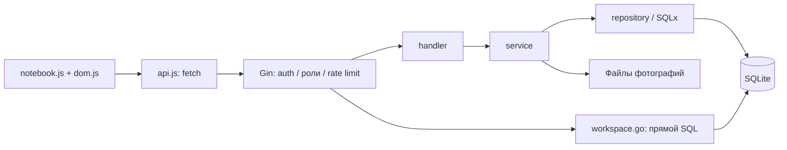

# Контур кафедры — передача проекта

Снимок кода от 11 сентября 2026, документация передачи от 12 сентября 2026. Начинать чтение с этого файла. Он заменяет устаревшие указания исходного README о запуске и удалении базы. Код при передаче не изменялся.

## Где находится версия

- Рабочая папка: `D:/Codex_Projects/Department/.local/event-redesign`.
- Исходник: https://github.com/danrulev/departament, ветка `event`, commit `bc77ea31630a9171b27df9b4bf43aa5b802de49a`.
- Fork: https://github.com/paulkuts/departament. Локальная ветка: `codex/lab-notebook`.
- Новые изменения НЕ отправлены в fork. Готовую версию брать из локальной папки или архива `department-handoff-2026-09-12.zip` в `D:/Codex_Projects/Department/deliverables`.
- ZIP — исходники без Git-истории, баз, фотографий пользователей, секретов, кэшей и binary. Контрольные суммы содержимого находятся в SOURCE_MANIFEST.json.
- Старый родительский проект Department — отдельная предыдущая версия; не смешивать с этим снимком.

## Что реализовано

| Раздел | Возможности |
|---|---|
| Обзор | Сводные данные имущества, ключей, публикаций, ближайших событий |
| Оборудование | Реестр, поиск, фильтры, пагинация, карточки, поверки, фотографии, QR |
| Инвентаризация | Мебель, химикаты, посуда через общую модель имущества |
| Ключи | Создание/изменение/удаление admin, выдача, возврат, утрата, держатель, история |
| Гостевые ключи | Непрозрачная QR-ссылка, заявка с именем/принадлежностью/целью, одобрение admin |
| Выдача оборудования | Получатель, комментарий, выдача и возврат, запрет двух активных выдач |
| Комментарии | Обсуждение в карточке имущества |
| Публикации | Метаданные, авторы (внутренние и внешние), статус, финансирование, ссылки |
| Задачи и события | Название, описание, место, время, признак публичности |
| Профили | Регистрация, вход, профиль, роли и активность, аватары |
| Мои заметки | Приватный список и редактор, сохранение в БД |
| Справочник | Таблица категория/название/значение/примечание, редактирует admin |
| Ассистенты | Только описание запланированных инструментов |

Не реализованы: научный AI-поиск, еженедельные сводки, совместный realtime-редактор статей, кабинеты студентов, загрузка учебных работ. Публикации сейчас — учёт метаданных, не редактор рукописей. Задачи представлены событиями, без исполнителей/лотов отработок. Выдача оборудования не включает оплату, договоры и бронирование.

## Архитектура и связи

Go/Gin HTTP-сервис, SQLx, SQLite modernc, Viper YAML, Zap, JWT. Frontend — native ES modules, без npm/React/сборщика. Проверенный локальный компилятор: Go 1.25.0 windows/amd64 (go.mod объявляет 1.23).



`main.go` встраивает frontend через go:embed. `internal/app/app.go` читает config, открывает БД, выполняет миграции, связывает repository → service → handler и запускает server. Новые workspace-функции используют SQL прямо в WorkspaceHandler, без отдельного service/repository. Это фактическая архитектура, не предписание её усложнять.

| Путь | Назначение |
|---|---|
| `main.go` | Точка входа, embedded frontend |
| `internal/app/app.go` | Связывание зависимостей, миграции, жизненный цикл |
| `internal/config/config.go` | Структуры и загрузка конфигурации |
| `internal/server/` | HTTP-сервер, таймауты |
| `internal/handler/handler.go` | Подключение public/protected маршрутов, SPA fallback |
| `internal/handler/middleware.go` | Аутентификация, актуальные роль/активность |
| `internal/handler/{auth,user,profile,key,inventory,photo,article,event}.go` | HTTP-контроллеры существующих функций |
| `internal/handler/dto.go`, `errors.go` | Форматы запросов/ответов, ошибки |
| `internal/handler/workspace.go` | Заметки, справочник, комментарии, loans, QR и заявки |
| `internal/service/` | Бизнес-операции, пароли, токены, фотографии |
| `internal/repository/` | SQL существующих модулей |
| `internal/models/` | Сущности, перечисления, фильтры |
| `internal/db/` | SQLite, migration ledger и SQL-миграции |
| `pkg/` | Хеширование, токены, QR, валидация, rate limiter, логгер |
| `frontend/index.html` | Оболочка приложения |
| `frontend/css/notebook.css` | Активные стили нового frontend |
| `frontend/js/notebook.js` | Состояние, hash-router, экраны и формы |
| `frontend/js/dom.js` | Helpers el/field/form/modal/button/table |
| `frontend/js/api.js` | HTTP-клиент, access token и refresh |
| Старые `frontend/js/app.js`, `ui.js`, CSS | Унаследованные файлы, не точка входа нового UI |
| `scripts/` | Локальный запуск, конфигурация, seed и проверки |

Hash-маршруты: welcome, overview, equipment, inventory, keys, articles, events, users, profile, notes, reference, assistants, requests; у сущностей есть карточки с ID. Поддерживается старый QR-маршрут `#/equipment/view/:id`. Гостевой QR использует pathname `/public/keys/:public_id`. Frontend встроен в binary: после правок нужна пересборка. Статика кешируется 24 часа; текущие URL основных ресурсов имеют v=2.

## Данные

| Таблица | Содержание и связи |
|---|---|
| users | UUID, профиль, хеш пароля, роль, активность |
| tokens | Refresh-сессии: user_id, role, token_id, expired_at |
| keys | Номер, помещение, notes, available/issued/lost |
| key_logs | key_id → keys, user_id → users, операция, время, комментарий |
| inventory | Тип, описание, место, номер, responsible_id → users, доступность, даты поверки |
| inventory_photos | inventory_id → inventory, uploaded_by → users, имя/MIME/размер; файл на диске |
| articles | Метаданные, planned/submitted/published, created_by → users |
| article_authors | article_id → articles, необязательный user_id → users, имя и порядок |
| events | creator_id, название, место, описание, start_time, is_public; creator_id в SQL без FK |
| personal_notes | owner_id → users, title/body, updated_at |
| reference_entries | category/name/value/notes |
| inventory_comments | inventory_id → inventory, author_id → users, body, время |
| inventory_loans | inventory_id, borrower_id, issued_by, comment, issued_at, returned_at |
| key_public_links | key_id → keys, уникальный непрозрачный public_id |
| key_requests | Ключ, данные гостя, pending/approved/rejected, ответственный и проверивший |
| schema_migrations | Учёт миграций и checksum |

Backend-типы имущества: equipment — оборудование; inventory — мебель/инвентарь; raw_material — химикаты/материалы; other — посуда/прочее. Отдельных таблиц по разделам нет. Частичный уникальный индекс запрещает две активные выдачи одного объекта. Операции ключей и одобрение заявки транзакционные.

Миграции: `20260325120000_init_schema.up.sql` — исходные сущности; `20260911120000_workspace.up.sql` — новые функции. SQLite использует foreign_keys, busy_timeout и WAL. Применённые миграции нельзя переписывать: создавать новую. Старую инструкцию исходного README «удалить базу при изменении миграции» не выполнять.

## Роли и сессии

Гость — посетитель без входа. Регистрация создаёт активного staff; переданная клиентом роль admin игнорируется. Admin может быть несколько; только admin меняет роли/активность и карточки ключей/имущества/фотографии. Staff читает внутренние реестры, пишет комментарии, ведёт свои заметки, берёт ключ на себя и возвращает свой. Admin может проводить операции за сотрудника и выдавать оборудование. Публикации изменяет создатель или admin. Заметки приватны даже относительно других admin.

Middleware после JWT проверяет актуальную роль и активность в БД. Пароль проверяется хешером. Access token хранится в памяти JS, refresh — HttpOnly SameSite=Strict cookie. Старый localStorage access token удаляется. Фото/аватары защищены входом. Скрытие кнопок не заменяет серверную авторизацию.

Гостевой процесс: admin получает QR → гость отправляет name/affiliation/purpose → admin назначает ответственного сотрудника и одобряет → ключ выдаётся сотруднику, гостевые сведения сохраняются в заявке. Мгновенная анонимная выдача не реализована.

Отметка утери и её отмена: admin помечает ключ утерянным (`POST /keys/:id/lost`), в карточке ключа та же кнопка становится «Отменить утерю» (`POST /keys/:id/restore`) и возвращает ключ в реестр как доступный. Оба события пишутся в журнал ключа с автором-администратором. Повторная отмена помеченного утерянным ключа — 409.

**Ограничения прав:** GET API пользователей доступен вошедшим, хотя UI управления показан admin. В API событий нет отдельной owner/admin-проверки изменения/удаления. is_public не означает гостевой API: публичная регистрация маршрутов событий не подключена. Отдельные полноценные сценарии преподавателя/студента не разработаны; заведующий лабораторией пока моделируется admin.

## Карта API

Префикс `/api/v1`, кроме `/health`. Форматы DTO сверять с handler/dto.go, models, api.js; единого OpenAPI нет.

| Модуль | Маршруты |
|---|---|
| Public auth | POST /auth/signin, /auth/register, /auth/refresh, /auth/logout |
| Public ключ | GET /public/keys/:public_id; POST /public/keys/:public_id/requests |
| Профиль | GET /me, /avatars/:user_id |
| Пользователи | GET/POST /users; GET /users/active; GET/PUT/DELETE /users/:id; POST /users/:id/activate; GET /users/:id/history; POST/DELETE /users/:id/avatar |
| Ключи | GET/POST /keys; GET/PUT/DELETE /keys/:id; POST /keys/:id/issue, /return, /lost, /restore; GET /keys/:id/history, /holder, /qr; POST /keys/:id/public-link |
| Имущество | GET/POST /inventory; GET /inventory/expired-verification; GET/PUT/DELETE /inventory/:id |
| Фото/QR | GET/POST /inventory/:id/photos; GET/DELETE /photos/:photo_id; GET /inventory/:id/qr |
| Публикации | GET/POST /articles; GET/PUT/DELETE /articles/:id |
| События | GET/POST /events; GET/PUT/DELETE /events/:id |
| Заметки | GET/POST /notes; PUT/DELETE /notes/:id |
| Справочник | GET/POST /reference; PUT/DELETE /reference/:id |
| Комментарии | GET/POST /inventory/:id/comments |
| Оборудование в пользовании | GET/POST /inventory/:id/loans; POST /loans/:id/return |
| Заявки | GET /key-requests; POST /key-requests/:id/approve с user_id; POST /key-requests/:id/reject |

Все маршруты, кроме двух public-групп, требуют входа. Мутации дополнительно проверяют роль/владельца там, где это реализовано (см. ограничения выше). DELETE пользователя означает деактивацию. Заметки/справочник возвращают прямые массивы, сохранение — 200 status/id, удаление — 204. Комментарий создаётся с 201, конфликт активной выдачи — 409.

## Самостоятельный запуск

### Текущий компьютер

Из рабочей папки `./scripts/dev.ps1` пересобирает и запускает http://127.0.0.1:18182/. Конфигурация `configs/local.yaml`, тестовая БД `.local/data/demo.db`, доступы только в `.local/demo-credentials.json`. Они не входят в архив. Seed не перезаписывает существующую базу. runtime.ps1 требует Go в `D:/Codex_Projects/Department/.tools/go`, локальные кэши и устанавливает GOPROXY=off: эти скрипты не универсальный deploy.

### Другой компьютер / сервер

1. Распаковать ZIP, установить Go (снимок проверен на 1.25.0). Из корня: `go mod download`, `go test ./...`, `go vet ./...`, `go build -o department .`. Для Windows можно назвать результат department.exe. npm не нужен.
2. Создать каталоги хранения БД, photos, avatars и export с правами сервиса. Создать `configs/production.yaml` по примеру ниже, заменив SECRET и абсолютные пути. YAML предпочтительнее неподтверждённых вложенных ENV-переменных: явный replacer точек в Viper не настроен.
3. Linux: `export REG_CONFIG_NAME=production`, затем `./department`. PowerShell: `$env:REG_CONFIG_NAME='production'`, затем `./department.exe`.
4. Рабочий каталог должен содержать configs и internal/db/migration. SQL-миграции НЕ встроены в binary. Также поддерживается каталог migration рядом с binary. Без найденных SQL-файлов startup пропускает миграцию с предупреждением.
5. Проверить /health, вход/refresh, права, файлы, выдачу/возврат, QR с реальным доменом. Настроить службу, HTTPS reverse proxy и резервные копии. Готовой проверенной конфигурации сервера в снимке нет.

```yaml
app:
  name: Department
  env: production
auth:
  access_token_ttl: 1h
  refresh_token_ttl: 24h
  jwt_secret: REPLACE_WITH_LONG_RANDOM_SECRET
photo:
  inventory_photo_dir: /srv/department-data/photos
  avatar_photo_dir: /srv/department-data/avatars
  max_photo_size: 10485760
  max_photos: 10
db:
  local_path: /srv/department-data/department.db
  data_dir: /srv/department-data
  export_dir: /srv/department-data/export
logger:
  level: info
  encoding: json
  output_paths: [stdout]
  error_output_paths: [stderr]
server:
  host: '127.0.0.1'
  port: '18182'
  max_header_bytes: 1048576
  read_timeout: 5s
  write_timeout: 10s
  idle_timeout: 120s
```

Первого production-admin автоматически не создаёт: зарегистрировать свой аккаунт, остановить сервер, доверенным SQLite-инструментом проверить UUID/email и назначить role=admin только этому UUID. Параметризованный SQL: `UPDATE users SET role='admin' WHERE id=?`; проверить изменение ровно одной нужной записи. Не использовать demo seed в production.

Реальная база не переносилась. Сделать согласованный backup SQLite и фотографий, проверить миграции на копии, затем переключать сервер. Для WAL использовать SQLite backup или закрытую БД после остановки сервиса; не копировать только .db во время записи. Откат должен учитывать версию кода, схему и данные вместе.

## Проверки и незавершённые места

Ранее прошли Go tests/vet/build и 38 live API-проверок на синтетической базе: вход, неверный пароль, роли, закрытие гостевого доступа, регистрация staff, приватность заметок, справочник, комментарии, loans и гостевой ключ. Проверены обзор, карточка оборудования, сохранение заметки, мобильная ширина 390px. smoke.py создаёт записи — только тестовая БД. Это не полный аудит исторического backend.

Исправления реализации: проверка пароля и инициализация хешера, актуальные права/активность, проверки admin перед мутациями, собственные операции ключей, права автора статьи, сохранение false DTO, migration ledger, SQLite pragmas, удаление встроенных аккаунтов startup.

Перед production следующему исполнителю учесть:

- В auth.go cookie явно имеет Secure:false при signin/refresh. HTTPS сам не меняет этот флаг.
- Права событий и раскрытие данных пользователей требуют отдельной проверки, см. выше.
- Открытая регистрация активного staff — решение владельца; email verification, приглашения и модерация не реализованы.
- Reverse proxy/trusted proxies, защита от злоупотреблений, политика данных, восстановление backup и миграция реальной базы не проверены.
- Унаследованный Dockerfile не проверен: содержит образ golang:1.25.0-nginx и CGO_ENABLE вместо CGO_ENABLED. Не считать его рабочим deploy-рецептом.

Эти ограничения зафиксированы без изменения сайта по указанию владельца.

## Передача следующему AI

Передать ZIP и задачу: «Прочитай AGENTS.md, HANDOFF.md, PRODUCT.md, PROJECT_STATE.md, DESIGN.md, DESIGN_IMPLEMENTATION.md и .impeccable/design.json. Сохрани модели, API и стиль Лабораторный журнал. Сначала проследи затронутый поток и серверные права. Выполни только следующую задачу: …».

Graphify может помогать навигации, но не обязателен для разработки/сборки. Карта кода может отставать; фактические связи и SQL проверять в исходниках. Запланированные возможности не являются автоматическим заданием их реализовать.
